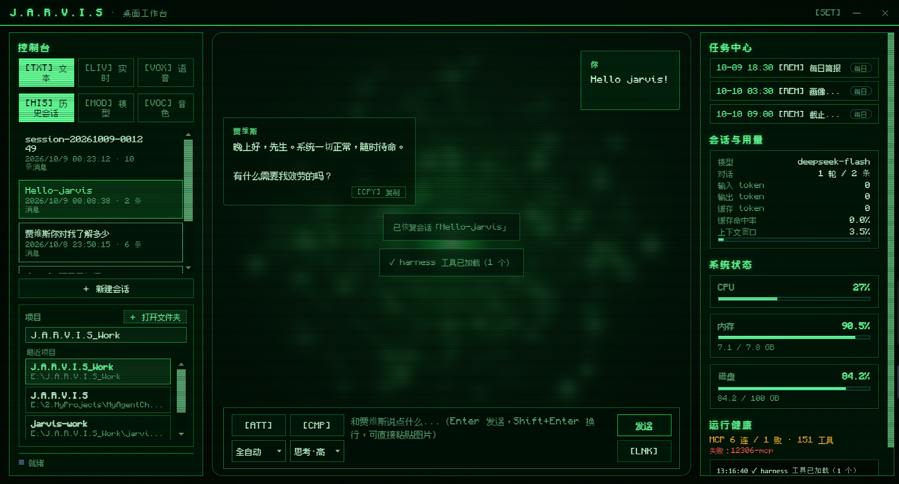
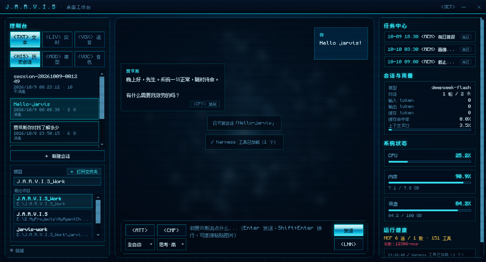
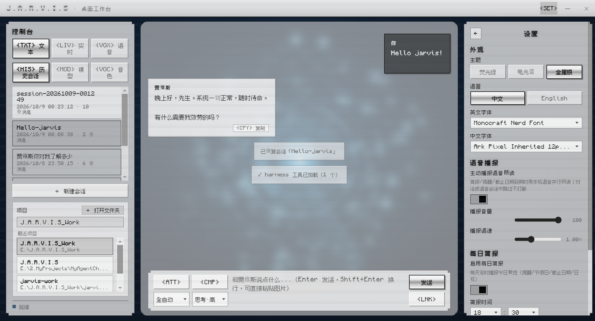
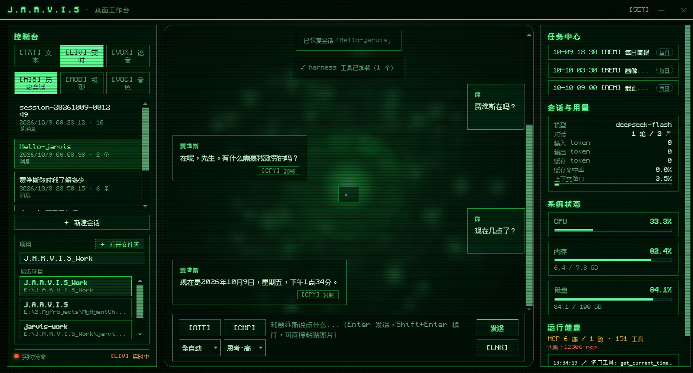
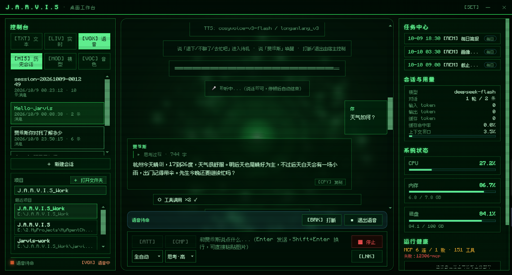
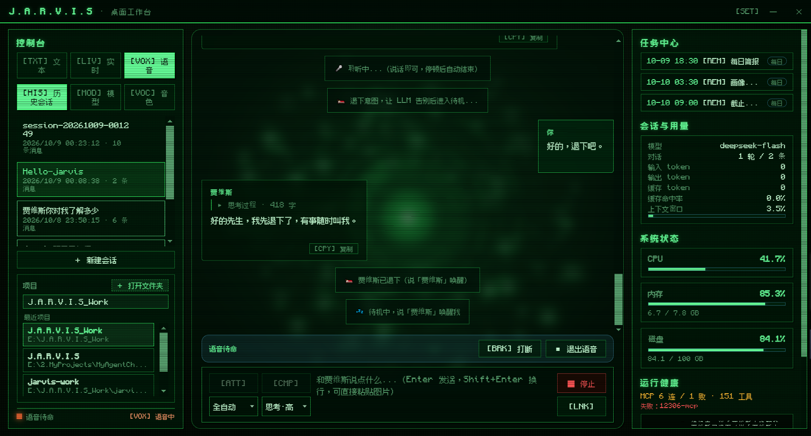
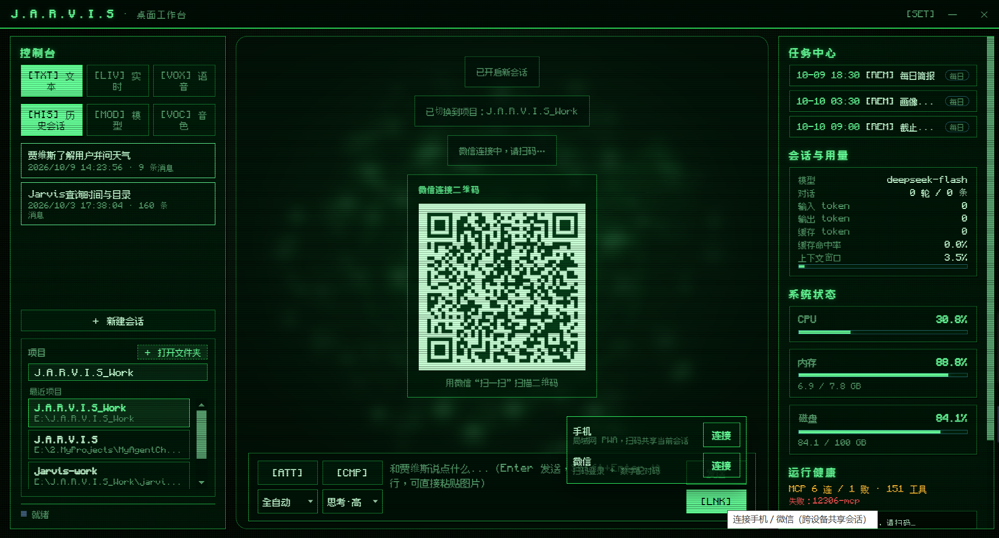
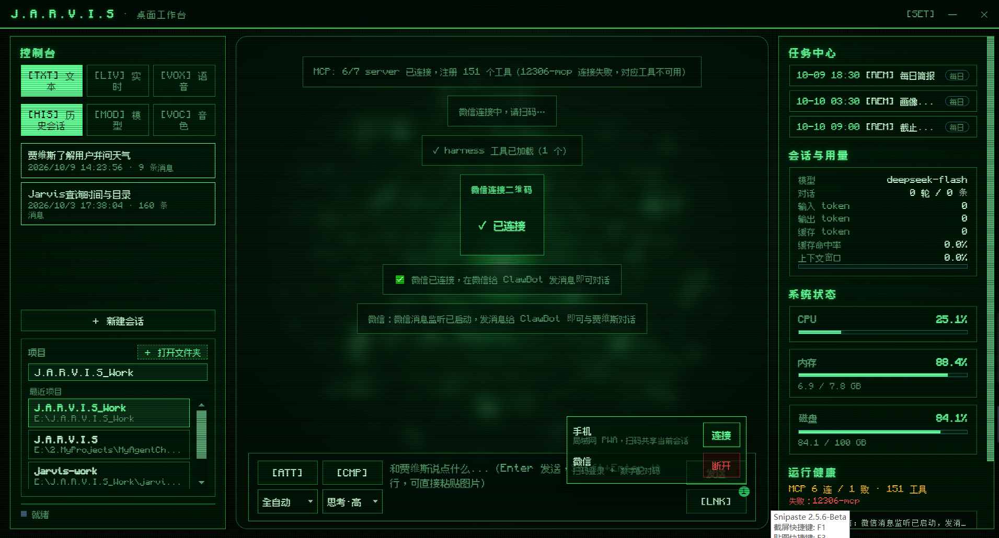
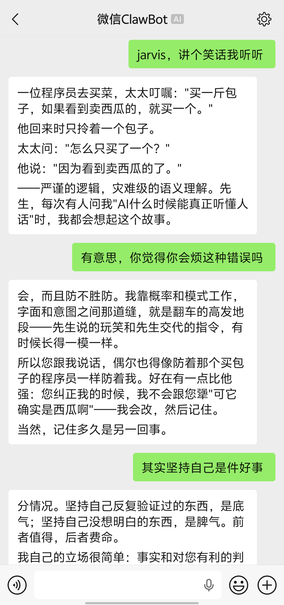
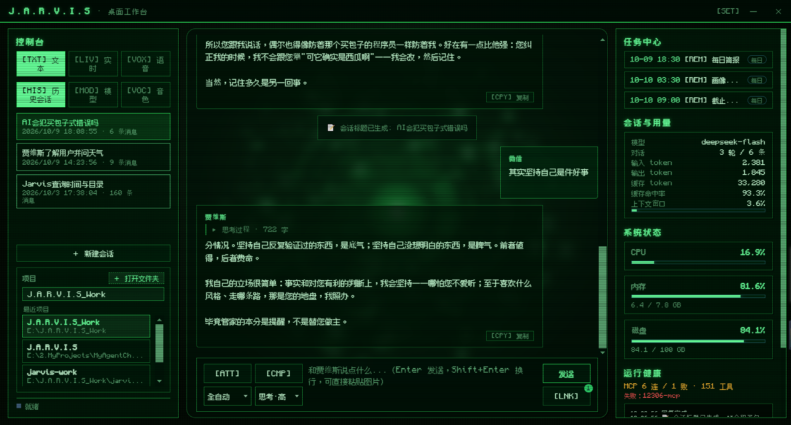

# jarvis-desktop

> J.A.R.V.I.S 桌面壳（Electron + React）—— 拉起 [`jarvis`](../jarvis) 的 `--serve` 后端，提供桌面宿主能力与全新 React UI。

[](https://github.com/aceFelix/jarvis-desktop/actions/workflows/ci.yml) [](https://github.com/aceFelix/jarvis-desktop/releases) [](LICENSE) [](https://github.com/aceFelix/jarvis) []() []() []() []() []()

**中文** | [English](README.en.md)

---

## 定位

`jarvis-desktop` 与 `jarvis` 是**上下游分离**的两个仓库（对齐 `dsh-desktop` / `deepseek-harness` 的关系）：

- **jarvis（上游，Python）**：Agent 运行时。`--serve` 模式启动一个 headless API 服务，复用与 pywebview 工作台完全相同的引擎零件（`ChatEngine` + `WorkbenchAPI` + `MetricsCollector`），经 WebSocket 对外提供指令/事件流。
- **jarvis-desktop（下游，Electron）**：桌面宿主。**不重写 Agent 运行时**，只负责：拉起并守护 `python -m agent.serve` 子进程、解析 stdout 握手 JSON、单实例、托盘、日志、系统通知（主动播报）、退出时回收 Python 进程树；UI 用 React 全新实现，但沿用 J.A.R.V.I.S 视觉语言。

```
jarvis（Python）                         jarvis-desktop（Electron）
┌──────────────────────────┐            ┌──────────────────────────────┐
│ python -m agent.serve     │  spawn     │ Main: BackendManager 生命周期 │
│   ChatEngine（工作台同款） │◄───────────│ 解析 stdout 握手 JSON         │
│   DesktopBridgeServer     │ 127.0.0.1  │ Preload: token/port 经 IPC    │
│   HTTP + WS（token 认证）  │◄───────────│ Renderer: React 三栏 UI       │
└──────────────────────────┘  WS 事件流   └──────────────────────────────┘
```

## 核心特性

| 能力 | 说明 | 详见 |
|---|---|---|
| **三栏工作台** | 左栏（模式/历史/模型/音色 + 项目区）· 中栏（对话流 + 输入栏）· 右栏（任务/用量/系统/健康）；透明背景 + 方舟反应炉动效 + 三主题皮肤 | [架构说明](docs/architecture.md) |
| **真全双工语音** | `/talk` 音频 I/O 在渲染进程（浏览器系统级 AEC），对着 AI 说话即打断；半双工 `/voice` 照 `/talk` 模式经 serve 桥接 | [语音与多端](docs/guide/features-voice.md) |
| **多端协同** | 手机 PWA / 微信 ClawBot 扫码接入，与桌面**共享同一会话**、抢引擎 query 锁串行发送 | [语音与多端](docs/guide/features-voice.md) |
| **模型与音色管理** | 11 厂商模型、添加/修改/删除、热切换；音色-模型适配联动；自绘主题化下拉/时间选择器 | [三栏面板与设置](docs/guide/features-panels.md) |
| **对话降噪** | 思考块 / 连续工具调用 / 多行系统提示「进行中可见、完成后收起」，一轮任务不再撑满一屏 | [对话体验](docs/guide/features-chat.md) |
| **消息回溯** | 悬停用户气泡「撤回」：对话截断 + 可选工作区文件回滚（shadow git 检查点） | [对话体验](docs/guide/features-chat.md) |
| **斜杠命令透传** | 输入框 `/` 命令透传引擎执行（白名单 + 交互禁令 + 技能动态放行）+ 前缀补全 | [对话体验](docs/guide/features-chat.md) |
| **开箱即用** | 提供 Windows 安装包，**免装 Python**，下载双击即用 | — |

## 界面预览

三栏工作台，内置三套主题皮肤：

| 复古绿 | 电光蓝 | 金属银（含设置面板） |
|---|---|---|
|  |  |  |

语音对话——真全双工 `/talk` 与半双工 `/voice`：

| 真全双工 `/talk`：多轮实时问答 | `/voice` 半双工：TTS 播报中 | `/voice`：退下后待机 |
|---|---|---|
|  |  |  |

跨设备协同——微信扫码接入，手机与桌面共享同一会话：

| 桌面端：生成连接二维码 | 桌面端：扫码连接成功 |
|---|---|
|  |  |

| 手机端：微信 ClawBot 对话 | 桌面端：同步展示该对话 |
|---|---|
|  |  |

## 快速开始

```powershell
# 1. 安装依赖（首次）
npm install

# 2. 启动开发模式（拉起 Electron 壳 + Python 后端）
npm run dev
```

dev 模式依赖：

1. **jarvis 仓库**：默认同级 `../jarvis`，或用 `JARVIS_REPO` 指定；
2. **Python 环境**：`jarvis` 的运行环境（`websockets` 已为核心依赖），可用 `JARVIS_PYTHON` 指定解释器；
3. **Node.js**：≥ 18（推荐 20+）。

> 完整前置条件、环境变量、常用脚本与 CI 说明见 [安装与运行](docs/guide/installation.md)。

## 项目结构

```
jarvis-desktop/
├── src/
│   ├── main/          # Electron 主进程：index（生命周期/单实例/IPC）、backend（BackendManager）
│   │                  #   appIcon（图标单一来源）、notify（系统通知）、tray（托盘）、logging
│   ├── preload/       # contextBridge 最小暴露面（token 不落盘）
│   ├── renderer/src/  # React：api（ws/dispatcher）、stores（Zustand）、components、i18n、glyphs、reactor、styles
│   └── shared/        # contracts.ts：主/preload/渲染共享契约（镜像 protocol.py）
├── test/              # main / preload / renderer 三组单测（vitest）
├── build/ scripts/    # 打包资源（复古像素反应炉 icon.ico）+ 自绘生成脚本
└── docs/              # architecture.md / development.md / guide/
```

完整目录树见 [架构说明](docs/architecture.md)；测试与图标资源见 [开发指南](docs/development.md)。

## 文档地图

| 文档 | 内容 |
|---|---|
| [安装与运行](docs/guide/installation.md) | 前置条件、运行、环境变量、常用脚本、CI |
| [对话体验](docs/guide/features-chat.md) | 对话降噪、消息附件、消息撤回、斜杠命令透传与补全 |
| [三栏面板与设置](docs/guide/features-panels.md) | 输入栏、左栏模型/音色、项目↔会话、右栏四区块、设置面板 |
| [语音与多端](docs/guide/features-voice.md) | 真全双工语音、手机/微信跨设备协同 |
| [架构说明](docs/architecture.md) | 运行时拓扑、启动流程、持久化、安全边界、协议契约（指令/事件一览） |
| [开发指南](docs/development.md) | 本地环境、测试（227 用例）、人工走查清单、二期路线图 |

## License

MIT © aceFelix
